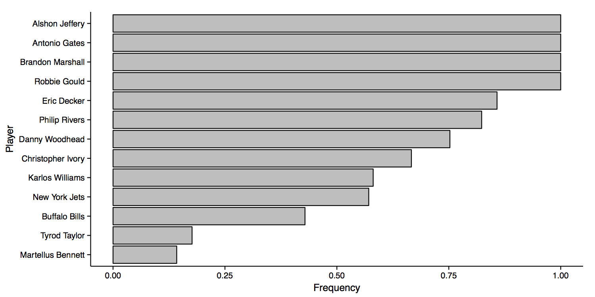

<!-- README.md is generated from README.Rmd. Please edit that file -->

## Overview

### Methods

Winning at FanDuel requires solving the following problem:

\[
\begin{gather}
\max_{\mathbf{x}} \; \mathbf{f} \cdot \mathbf{X} \\
\text{subject to} \; \; \left\{
    \begin{array}{l}
    \mathbf{x} \; \; \text{is an "eligible" team} \\
    \mathbf{p} \cdot \mathbf{x} \leq \$60,000
    \end{array} \right.
\end{gather}
\]

where \(\mathbf{X}\) denotes a vector of binary variables corresponding
to all available fantasy players, \(\mathbf{f}\) denotes the vector of
fantasy points each of these players scores, and \(\mathbf{p}\) denotes
the vector of each player’s salary. The operator \(\cdot\) denotes the
dot product.

The goal is to choose a set of players – denoted by the vector
\(\mathbf{x}\) – that maximizes total fantasy points while also
satisfying the constraints: (i) \(\mathbf{x}\) is an “eligible” team
consisting of one quarterback, two running backs, three wide receivers,
one tight end, one place kicker, and one team defense (ii) the cost of
\(\mathbf{x}\) is less than the $60,000 salary cap. FanDuel imposes two
more nuanced eligibility constraints as well: (iii) \(\mathbf{x}\) can
contain at most four players from one team (iv) \(\mathbf{x}\) must
contain players from at least three different teams.

This optimization problem is made somewhat more complicated by the fact
that the elements of \(\math{x}\) are binary:

\[
\begin{gather}
x_i = \; \; \left \{
    \begin{array}{ll}
    1 & \text{if player $i$ is chosen} \\
    0 & \text{otherwise}
    \end{array} \right.
\end{gather}
\]

However, the problem is still easily solved using a computer.

What makes the problem challenging is that the vector \(\mathbf{f}\) is
unknown prior to choosing \(\mathbf{x}\). Only after teams are chosen
does the realization of \(\mathbf{f}\) occur. Thus, the objective is
more accurately described by:

\[
\begin{gather}
\max_{\mathbf{x}} \; \text{E} \left[ \mathbf{f} \cdot \mathbf{X} \right ]
\end{gather}
\]

where **expected** points are being maximized and \(\mathbf{f}\) is
recognized as being stochastic. Thus, winning at FanDuel depends
critically on one’s belief about which realization of \(\mathbf{f}\) is
most likely to occur.

One possible belief could be that player \(i\)’s expected \(f_i\) is
given by the weighted average:

\[
\begin{gather}
f_i = \frac{1}{3} f_i^{FD} + \frac{1}{3} f_i^{FP} + \frac{1}{3} f_i^{L}
\end{gather}
\]

where \(f_i^{FD}\) is a weighted average of player \(i\)’s past
performances provided by FanDuel, \(f_i^{FP}\) is player \(i\)’s
projected performance provided by FantasyPro’s, and \(f_i^{L}\) is an
actual performance by player \(i\) in a previous game (i.e. a lagged
performance). Using past performance – as in \(f_i^{FD}\) and
\(f_i^{L}\) – is an obvious place to start; forecasts are usually based
on the past. Additionally, projections are useful because they are
provided by “experts” who have more in-depth information regarding each
of the players; such information would be too costly to collect
otherwise.

One limitation of values like \(f_i^{FD}\) and \(f_i^{FP}\) is that they
are deterministic and do not come with any associated measure of error.
For example, FantasyPro’s might predict Marshawn Lynch will score 25
points but perhaps that prediction is actually based on a range with 25
just being the average. One way to capture this type of uncertainty is
through the value \(f_i^L\).

<!-- -->

The figure  shows all of Lynch’s past performances through week nine of
the 2015 season. The variability in the performances is presumably due
to a variety of factors. For example, Lynch’s top performances all occur
during home games. Other factors might include the strength of the
opposing team’s defense, Lynch’s health, performances by Lynch’s
teammates, etc. The sheer number of likely contributors to any one
performance is why they are so hard to predict.

One way to avoid this modeling problem is to just ignore it altogether.
We can simply assume that Lynch’s performance during any given game is a
random draw from the distribution of his scores shown above. In other
words, we ignore all the potential contributors and simply assume that
the Lynch we observe this week will be one of the Lynch’s we observed in
some past week. To be sure this assumption is strong and most likely
incorrect. For instance, if we knew Lynch was not playing at home we
should probably throw out all of his performances above 24 points.
However, this starts us down a dangerous path of adding more and more
complexity. Should we throw out games later in the season too? What if
the game was on a Monday instead of a Sunday? What if the opponent is a
division rival? Such questions continue **ad infinitum**.

Returning to the optimization problem, we can define a lagged
performance as:

\[
\begin{gather}
\hat f_i^L \in \bm{F_i}
\end{gather}
\]

where \(F_i^L\) is the set of all past performances by player \(i\). In
the case of Lynch, \(F_i^L\) contains all the observed performances
illustrated by in the figure. If player \(i\) has no past performances
we substitute the average weekly performances from across the league at
that player’s position. The benefit of this approach is that we can take
a draw of past performances for all the players, calculate their
expected performances, and then solve the optimization problem.
Repeating this process over and over again generates a frequency
distribution that a given team also ends up being optimal among all the
samples from the \(F_i^L\)’s. If some team – call it $ $ – is optimal
sufficiently often than we might expect \(\mathbf{x^*}\) to be robust to
winning regardless of the actual realization of \(\mathbf{f}\) (at least
in expectation).

### Results

The following analysis illustrates the above method for the limited
fantasy game which included:

  - Chicago Bears @ San Diego Chargers
  - Buffalo Bills @ New York Jets

The set of available players for the fantasy team was refined from those
actually available in each of the above match-ups by eliminating players
who were listed as Questionable, Doubtful, Out, or on Injured Reserve.
Players who received a projection of zero on FantasyPro’s were also
eliminated; this removes backups who were unlikely to play. For those
players that received no projection on FantasyPro’s the average
projection for their position was used.

A total of 100,000 samples were taken from the \(F_i^L\)’s. The linear
programming packages *lpSolve* and *Rglpk* were used to solve the
problem. Thus, for each of the draws, two solutions were found.
Typically, these solutions were the same but in some cases they differed
due to differences in the algorithms used by each of the packages.

<!-- -->

The figure above shows the results from applying this resampling method.
Team A consisting of:

  - Phillip Rivers
  - Chris Ivory
  - Danny Woodhead
  - Alshon Jeffery
  - Brandon Marshall
  - Antonio Gates
  - Eric Decker
  - Robbie Gould
  - New York Jets Defense

was optimal in just over 25 percent of the samples. Teams B and C were
each optimal in roughly 15 percent of the samples. Comparing these to
Team A, Teams B and C use Karlos Williams instead of Christopher Ivory
or Danny Woodhead and also use the Buffalo Bills Defense instead of the
New York Jets Defense. Clearly, however, a smoking gun was not found.

More distressing is the fact that such high team frequencies are much
less likely to be seen when considering fantasy games which include all
the Sunday and Monday games. This is simply because there are so many
more possible teams.

With this in mind, an additional metric likely to be useful is the
frequency of times a certain player is on the optimal team. The figure
below illustrates these frequencies.

<!-- -->

We can see that Alshon Jeffery, Antonio Gates, Brandon Marshall, and
Robbie Gould were members of every winning team. We could further look
at frequency plots based on position to better improve player selection.
